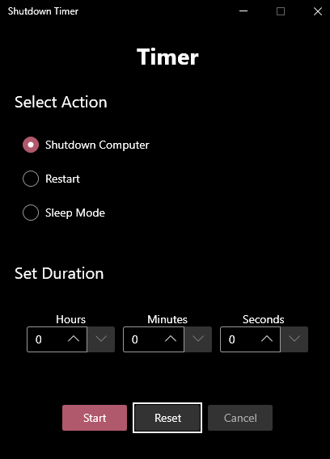
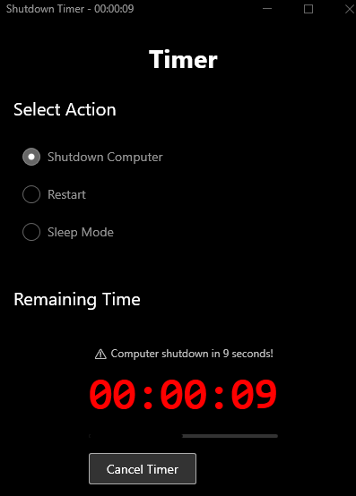

# 🕐 Shutdown Timer

A modern, user-friendly Windows application for scheduling system shutdown, restart, or sleep operations with a customizable countdown timer.

## 📸 Screenshots

<table>
<tr>
<td></td>
<td></td>
</tr>
<tr>
<td align="center"><em>Main interface with timer setup</em></td>
<td align="center"><em>Timer in action with countdown display</em></td>
</tr>
</table>

## ✨ Features

- **🔄 Multiple System Actions**: Support for shutdown, restart, and sleep mode
- **⏰ Flexible Timer**: Set countdown time using hours, minutes, and seconds
- **📊 Visual Countdown**: Real-time countdown display with progress bar
- **📋 System Tray Integration**: Minimize to system tray and continue running in background
- **⚠️ Warning System**: Visual and audio warnings in the final seconds
- **🎨 Modern UI**: Clean, modern interface using ModernWPF styling
- **🌙 Theme Support**: Automatically adapts to system theme (Light/Dark)
- **🚀 One-Click Launch**: No installation required, just double-click to run
- **📦 Portable**: All dependencies included, single executable file
- **🔄 Reset Function**: Easy time reset with dedicated reset button

## 🚀 Quick Start

### 📥 Download Ready-to-Use (Recommended)
1. Go to the [Releases](../../releases) page
2. Download `Shutdown Timer.exe` from the latest release
3. Copy to your desired folder
4. Double-click to run - **No installation required!** ✅

### 🛠️ Build from Source (For Developers)
1. Clone this repository
2. Run `build-release.bat` 
3. Double-click the generated `Shutdown Timer.exe`
4. Ready to use! ✅

## 📋 System Requirements

- Windows 10/11 (64-bit)
- No additional software required!

## 📖 Usage

1. **🎯 Select Action**: Choose between Shutdown, Restart, or Sleep mode
2. **⏱️ Set Duration**: Use the number boxes to set hours, minutes, and seconds
3. **🔄 Reset Time**: Click "Reset" button to clear all time values
4. **▶️ Start Timer**: Click "Start" button to begin countdown
5. **👀 Monitor Progress**: Watch the real-time countdown and progress bar
6. **❌ Cancel Anytime**: Use "Cancel" button or system tray menu to stop the timer

### ⚠️ Warning System

- **30 seconds**: Orange countdown color
- **10 seconds**: Red flashing countdown with warning messages
- **🔊 Audio Alerts**: Sound warnings every 2 seconds in final 10 seconds
- **💬 Notifications**: System tray balloon tips at key moments

## 🛠️ Building from Source

### Requirements
- Visual Studio 2022 or later
- .NET 6.0 SDK or later

### Build Steps
1. Clone this repository
2. Open `ShutdownTimer.sln` in Visual Studio
3. Restore NuGet packages
4. Build the solution (Ctrl+Shift+B)

### Quick Build
```bash
# For automatic build
./build-release.bat
```

### Dependencies
- **ModernWpf**: Modern UI styling
- **Hardcodet.NotifyIcon.Wpf**: System tray functionality

## 🔧 Technical Details

- **Framework**: .NET 6.0 WPF
- **UI Framework**: ModernWPF (Windows 11 style design)
- **Architecture**: MVVM-friendly single window application
- **Threading**: Async/await pattern for non-blocking operations
- **Deployment**: Self-contained, single-file executable

## 📄 License

This project is licensed under the MIT License - see the [LICENSE](LICENSE) file for details.

## 🤝 Contributing

Contributions are welcome! Please feel free to submit a Pull Request.

## 💬 Support

If you encounter any issues or have feature requests, please create an issue on the [Issues](../../issues) page.
